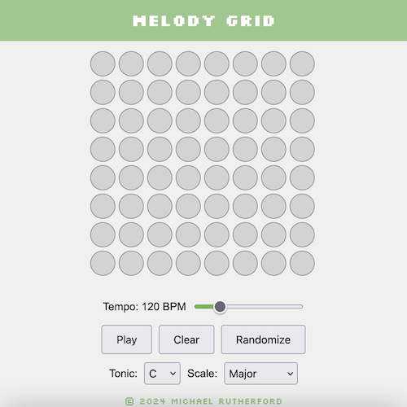

# EduMelody
A musical grid sequencer for building melodies with multiple instruments, tunings, and export options.

Built with HTML, CSS, and JavaScript.

## Features
- Grid-based sequencer with adjustable note count and pulse count (8/16/32).
- Tempo control with live BPM display.
- Key controls: tonic + scale (Major, Minor, Lydian, Mixolydian, Dorian, Phrygian, Locrian).
- Instrument selection:
  - SoundFont instruments (piano, guitar, orchestra, etc.).
  - Synth waveforms (sine/triangle/square/sawtooth).
- Note length cycling per cell (1–4 steps) with color-coded durations.
- Articulation control (sustain or discrete) for how consecutive notes are played.
- Randomize and clear actions.
- Play/pause with spacebar shortcut.
- Export to WAV with progress overlay.
- Language selector (auto-detects browser language, manual ES/CA/EN).
- Responsive layout with collapsible controls panel on mobile.
- Grid state preserved when changing note or pulse counts.

## Run locally
SoundFont instruments are loaded over the network. For best results, run with a local HTTP server (opening `index.html` via `file://` can cause browser restrictions).

From this folder:

```bash
python3 -m http.server 8000
```

Then open:

`http://localhost:8000/`



Forked from 
https://github.com/michaelrutherford/melody-grid
## License
EduMelody is licensed under version 3 of the GPL. For more information, see `LICENSE`.
